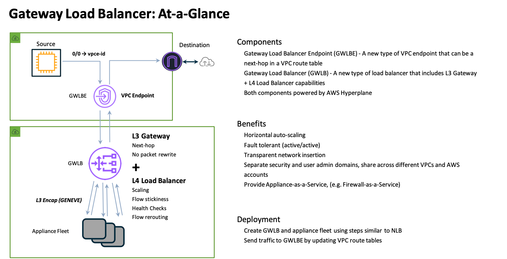
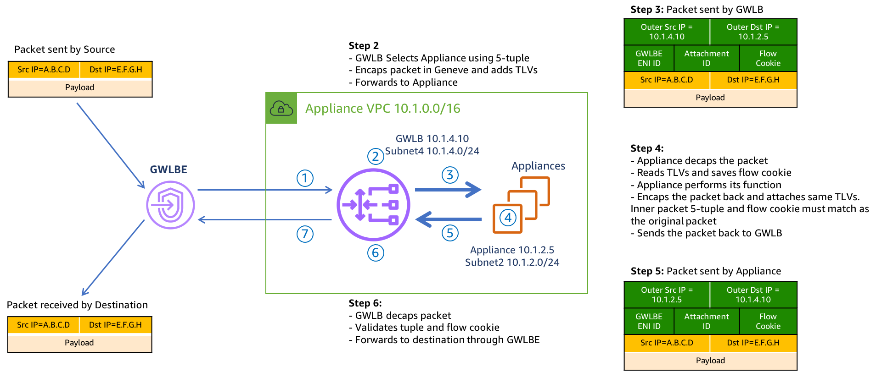
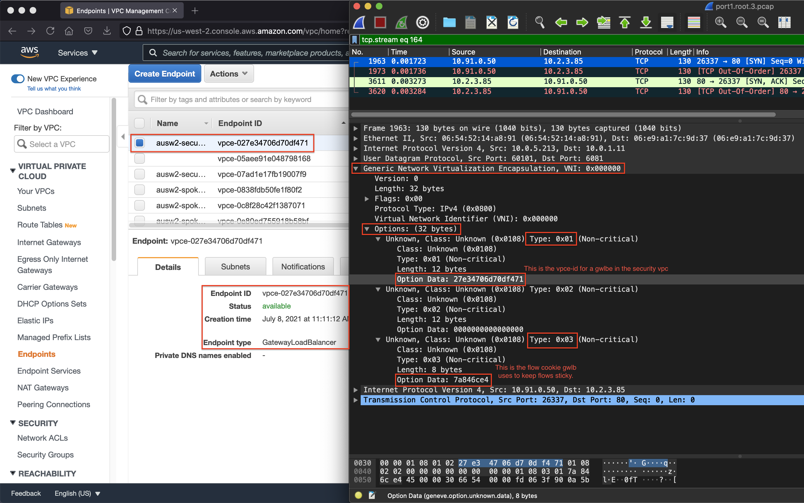
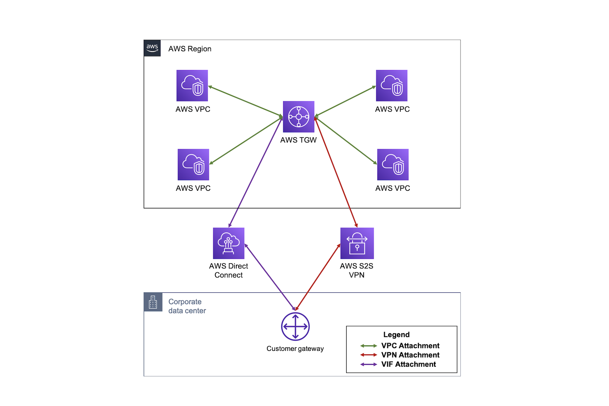
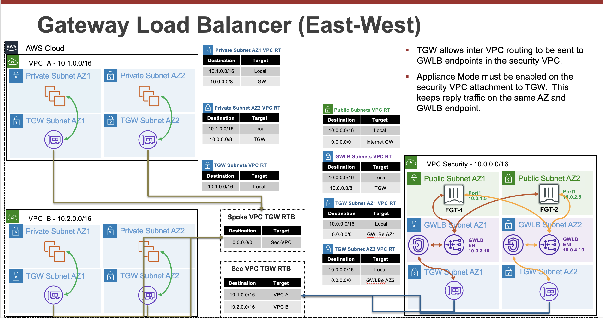
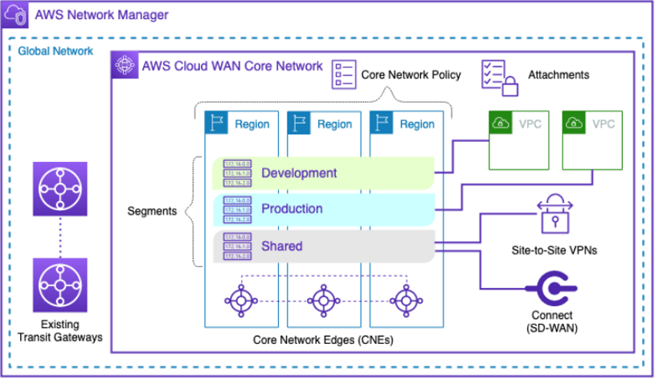

**Expand each section to see the details.**

{}

GWLB is a load balancer that accepts all IP traffic and forwards this to targets in a target group.  GWLB supports being deployed into multiple availability zones.  GWLB itself receives traffic with the use of GWLB endpoints (GWLBe).  GWLBe are VPC endpoints that you deploy into your workload VPC's subnets for distributed inspection or an inspection VPC's subnets for centralized inspection using Transit Gateway or Cloud WAN.  Then you can use VPC routing to send traffic to the GWLBe in the same availability zone.

With the introduction of VPC Ingress Routing back in 2019, you can apply VPC route tables to an Internet Gateway (IGW) or Virtual Private Gateway (VGW).  This allows you to direct traffic destined to a local VPC subnet to a GWLBe in the same availability zone.  This means you can inspect inbound traffic before it is sent to a public load balancer or instance.  Along with this feature release, any VPC route table, applied to a public or private subnet, can have a route for a local VPC subnet and direct this traffic to a GWLBe. This allows inspection of egress flows as well.

Once the GWLBe receives the traffic, it uses PrivateLink to privately route the traffic to a GWLB node in the same availability zone.  Since GWLB can be deployed across multiple availability zones, there is a GWLB node in each availability zone.  For more  details on this, reference [**AWS Documentation**](https://docs.aws.amazon.com/vpc/latest/privatelink/vpce-gateway-load-balancer.html).

Each GWLB node uses an IP listener to receive the traffic and then forward traffic to the target group specified in the listner rule.  GWLB nodes maintains stickiness of flows to a specific target group member using 5-tuple hash (for TCP/UDP flows) or 3-tuple hash (for non-TCP/UDP flows).  This allows traffic for a specific flow to symmetrically be routed to the same FortiGate so layer 7 NGFW inspection, including SSL Man in the Middle (MitM), can be applied.

{}
GWLB has a default idle timeout of 350 seconds for TCP flows and fixed 120 seconds for non-TCP flows. Once the idle timeout is reached or a TCP connection is closed for a flow, it is removed from GWLB’s connection state table.  To prevent this from happening, it is recommended to configure TCP keep-alive setting to less than 350 seconds on either client/server’s application/Operating System (OS).  

Starting in 2024, AWS GLWB supports configurable idle timeout for TCP only. You can set this to a value from as low as 60 seconds up to 6000. It is also recommended to increase this to match the same TCP idle timeout values used in your FortiGates.
Reference [**AWS Documentation**](https://docs.aws.amazon.com/elasticloadbalancing/latest/gateway/update-idle-timeout.html).
{}

By default, each GWLB node deployed in an availability zone distributes traffic across the registered and healthy targets within the same availability only. If you enable cross-zone load balancing, each GWLB node distributes traffic across all registered and healthy targets in all enabled Availability Zones.

Once a GWLB node picks a target to send traffic to, it will encapsulate the data plane traffic in a GENEVE tunnel and forwards this to the target.  When the FortiGate receives the GENEVE traffic, it will terminate the tunnel and inspect the original data plane traffic using NGFW policies and features.  The GENEVE tunnel header uses TLVs that includes information such as the VPC endpoint id of the GWLBe that received the original traffic and the flow hash.  For more details on this, reference [**AWS Documentation**](https://aws.amazon.com/blogs/networking-and-content-delivery/integrate-your-custom-logic-or-appliance-with-aws-gateway-load-balancer/).

After NGFW inspection, the FortiGate can use simple policy and static routing to either route the traffic back to the same GWLB node using a GENEVE tunnel or send this out a local interface to access internet-based resources.  With simple policy and routing changes you can change how routing is handled to support different use cases.

After the GWLB node receives the traffic back from the FortiGate, it sends the traffic back to the same GWLBe that originally received the traffic.  Finally, the GWLBe in the workload VPC will send the traffic to the intrinsic router which uses the assigned VPC route table's routes to send the traffic to the destination.

Here is an example of a deployed GWLBe and the GENEVE headers for traffic inspected by that endpoint. You can see the VPC endpoint ID and flow cookie.

{}

{}

TGW is a highly scalable cloud router that connects your VPCs in the same region to each other, to on-premises networks, and even to the internet through one hub. With the use of multiple route tables for a single TGW, you can design hub and spoke routing for traffic inspection and enforcement of security policy across multiple VPCs. Notice the TGW RTBs below allow the FortiGates in the inspection VPC inspect east/west traffic between the spoke VPCs. As the name implies, [**Transit Gateway supports transitive routing**](https://docs.aws.amazon.com/vpc/latest/tgw/TGW_Scenarios.html). This means the inspection VPC can be used for east/west, centralized egress, and centralized ingress as well.

{}

{}

[**AWS Cloud WAN (CWAN)**](https://docs.aws.amazon.com/network-manager/latest/cloudwan/what-is-cloudwan.html) is an intent-driven managed wide area network (WAN), described by a policy you define that unifies your data center, branch, and AWS networks. While you can create your own global network by interconnecting multiple Transit Gateways across Regions, Cloud WAN provides built-in automation, segmentation, and configuration management features designed specifically for building and operating global networks, based on your core network policy. Cloud WAN has added features such as automated VPC attachments, integrated performance monitoring, and centralized configuration.  Similar to Transit Gateway you can have an inspection VPC for east/west, centralized egress, and centralized ingress inspection also. Further, you can use [**Cloud WAN Service Insertion Rules**](https://docs.aws.amazon.com/network-manager/latest/cloudwan/cloudwan-policy-service-insertion.html) to simplify inspecting traffic for any flow within a single region and especially for multi-region inspection.

{}