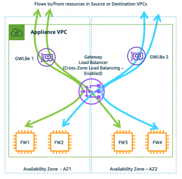
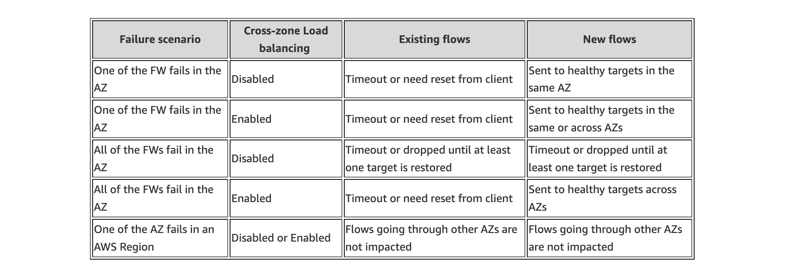

**Expand each section to see the details.**

{}

AWS Elastic Load Balancing services all have a form of health checking targets in a target group to provide resiliency.  **With GWLB an important point to note is how target failure behavior is handled when all targets in a single availability zone have failed.**

By default, cross zone load balancing is disabled on GWLB.  This means that if all targets in a single availability have failed (ie AZ1), the GWLB node in that same availability zone will not send traffic to healthy targets in different availability zone (ie AZ2).  Instead, the GWLB node will fail open and continue to send any traffic it receives to the same unhealthy targets in the same availability zones.

To change this behavior, you can simply enable cross zone load balancing.  This changes the behavior so that if all targets in a single availability have failed (ie AZ1), the GWLB node in that same availability zone will send traffic to healthy targets in different availability zones (ie AZ2, AZ3).  In fact, with cross zone load balancing enabled, the GWLB nodes will be evenly distributing traffic to healthy FortiGates in all zones.

{}
**Thus we recommend that cross zone load balancing should be enabled for the best resiliency for your environment.**  For more details on this, reference [**AWS Documentation**](https://aws.amazon.com/blogs/networking-and-content-delivery/scaling-network-traffic-inspection-using-aws-gateway-load-balancer/).
{}

{}

{}

GWLB target groups can be configured to rebalance existing flows from an unhealthy target to a healthy target.  The current default behavior is no_rebalance.  When selected, GWLB will continue to send existing flows to failed/deregistered target. New flows are always sent to the healthy target.  You can select rebalance and GWLB calculates the new hash value for existing flows and sends the flows to another healthy target.

{}
It is important to understand the time intervals involved in this feature. The total target failover time is a combination of multiple time intervals. Target Failover time = (time taken to detect failed target/drain the target) + (time taken to synchronize the GWLB data plane and to rebalance the flow to the new target). Sum of all these times may add up significantly and it may cause a delay in rebalancing existing flows to the healthy targets.

**For flows to rebalance faster, AWS recommend using the lowest possible values for health check setting and the deregistration delay timeout. For example, setting “Deregistration Delay” to 60 seconds allows flow to rebalance to healthy target in ~120 seconds.**  Reference [**AWS Documentation**](https://aws.amazon.com/blogs/networking-and-content-delivery/introducing-aws-gateway-load-balancer-target-failover-for-existing-flows/).
{}

Considering the long time to failover existing flows, this is only recommended in environments using legacy apps that will not initiate new TCP connections when existing ones are unresponsive and timeout.

Also, this requires using FortiGate Session Life Support Protocol [**(FGSP)**](https://docs.fortinet.com/document/fortigate/7.4.3/administration-guide/668583/fgsp) to sync the required sessions across FGTs in the same or all AZs, depending if cross zone load balancing is used.  This has overhead on compute resources and should be configured to only sync the sessions for those legacy applications using the **config session-sync-filter** config settings per FGSP peer.

{}