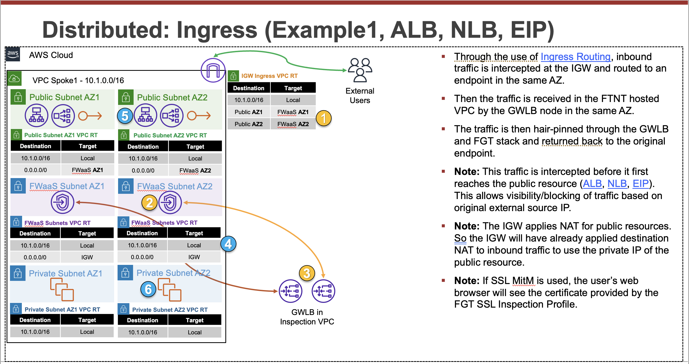
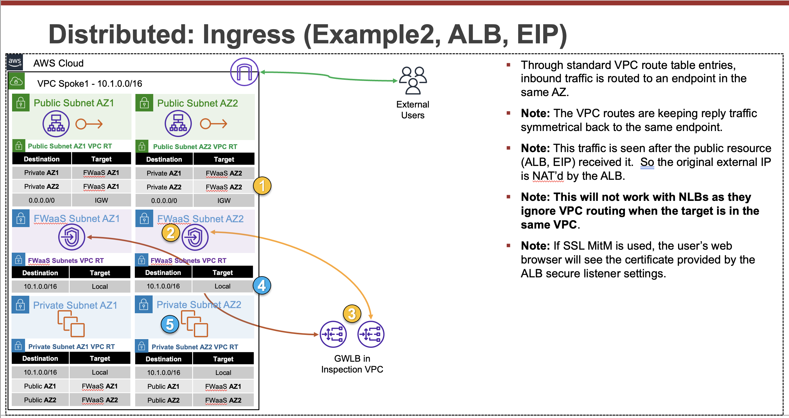
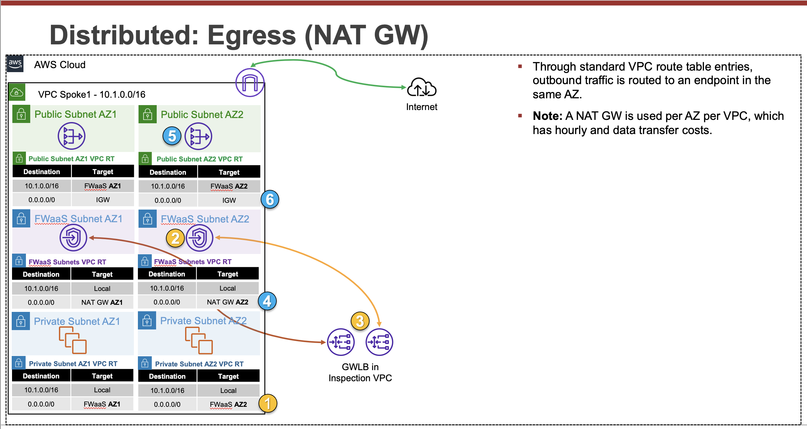
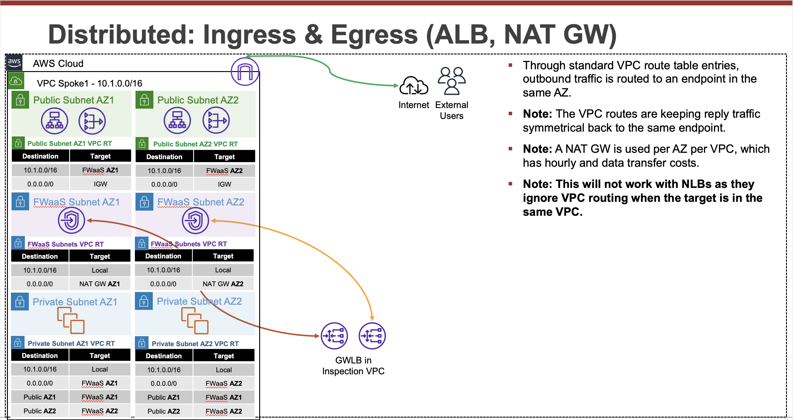
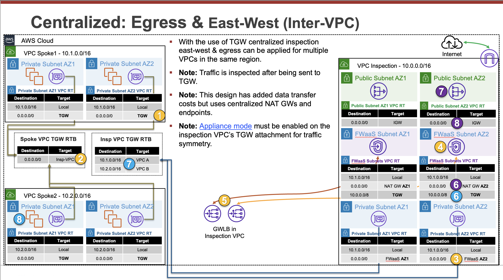

It is best practice to use Infrastructure as Code (IaC) templates to deploy FortiGates & GWLB in AWS as there are quite a bit of components that make up the entire solution.  These can be used to deploy a new VPC.  You can also integrate with a new or existing Transit Gateway as well.

Reference the CloudFormation and Terraform templates in the Github repos below and reference the quick start guides for how to use these for a deployment.

**fortigate-aws-gwlb-cloudformation**
  - [**Repo**](https://github.com/FortinetCloudCSE/fortigate-aws-gwlb-cloudformation)
  - [**Quick Start**](https://fortinetcloudcse.github.io/fortigate-aws-gwlb-cloudformation/)

**fortigate-aws-gwlb-terraform**
  - [**Repo**](https://github.com/FortinetCloudCSE/fortigate-aws-gwlb-terraform)
  - [**Quick Start**](https://fortinetcloudcse.github.io/fortigate-aws-gwlb-terraform/)

{}
You will need administrator privileges to run these templates as they are creating IAM roles, policies, and other resources that are required for the solution and automating deployment.
{}

Here are common inputs (parameters & variables) across the CloudFormation and Terraform templates that are important to understand before deployment. Reference additional sections under Use Cases to better understand these options from an architectural perspective.

---

Key inputs for Inspection Template/Module:
| Inspection Input (CFT / TF) | CFT | Terraform | Description |
|-----------|---------------|-----------|-------------|
| **InternetAccess** / **internet_access** | `EIP` (default) `NatGW` | `eip` (default) `natgw` | How FortiGates access internet - Elastic IPs or regional NAT Gateway |
| **ArmMode** / **arm_mode** | `1-arm` (default) `2-arm` | `1-arm` (default) `2-arm` | Single data ENI (1-arm) or two data ENIs (2-arm) |
| **DedicatedManagement** / **dedicated_management** | `False` (default) `True` | `false` (default) `true` | Attach dedicated management ENI |
| **DedicatedManagementPlacement** / **dedicated_management_placement** | `Private` (default) `Public` | `private` (default) `public` | Place management ENI in Public or Private subnet |
| **CwanIntegration** / **cwan_integration** | `No` (default) `New` `Existing` | `no` (default) `new` `existing` | Deploy new Cloud WAN + 2 spoke VPCs, use existing, or none |
| **TgwIntegration** / **tgw_integration** | `No` (default) `New` `Existing` | `no` (default) `new` `existing` | Deploy new Transit Gateway + 2 spoke VPCs, use existing, or none |
| **NumOfFgtsPerAZ** / **num_of_fgts_per_az** | `1` (default) `2` | `1` (default) `2` | Number of FortiGates to deploy per Availability Zone |

---

Key inputs for Spoke Template/Module:
| Spoke Input (CFT / TF) | CFT | Terraform | Description |
|-----------|-----------|---------------------------|-------------|
| **DistributedInspection** / **spoke_vpc1/2_distributed_inspection** | No default | `"1: Distributed Ingress @ IGW"` (vpc1 default) `"4: Option 2 + 3 above"` (vpc2 default) | Select distributed inspection option for VPC routing |
| **RouteToCwanOrTgw** / **spoke_vpc1/2_route_to_cwan_or_tgw** | No default | `"0.0.0.0/0"` (vpc1 default) `"10.0.0.0/8"` (vpc2 default) | Network CIDR to create VPC routes to reach resources via CWAN or TGW |

**DistributedInspection Allowed Values (both CFT & Terraform):**
- `"1: Distributed Ingress @ IGW"` 
{}

{}
- `"2: Distributed Ingress @ Public Subnets"`
{}

{}
- `"3: Distributed Egress"`
{}

{}
- `"4: Option 2 + 3 above"`
{}

{}
- `"5: No Distributed Ingress or Egress Inspection (use Cwan or Tgw for centralized inspection)"`
{}

{}

**RouteToCwanOrTgw Notes:**
- Use `0.0.0.0/0` for centralized egress and east-west inspection
- Use RFC-1918 ranges (e.g., `10.0.0.0/8`) for centralized east-west inspection only
