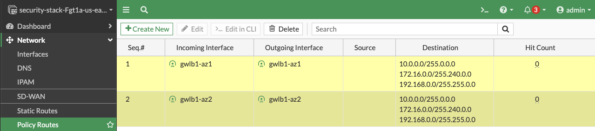

{}
This is picking up after a successful deployment of FGCP with CloudFormation.  The same steps can be used, post deployment, to validate a successful setup and test failover.
{}

1.  When using CloudFormation, your stack will have outputs you can use to login to the FortiGates via the cluster or dedicated EIPs.  If you used Terraform, these outputs will be listed in your terminal session.  If you chose to deploy a new TGW as part of the deployment you will see the IDs of your Transit Gateway and TGW Route Tables. These can be used as inputs for the **‘SpokeVPC_TGW_MultiAZ.template.json’** template.

    

    ```
    Apply complete! Resources: 85 added, 0 changed, 0 destroyed.
    
    Outputs:
    
    fgt_login_info = <<EOT
    # fgt username: admin
    # fgt initial password: instance-id of the fgt
    # fgt_ids_a : ["i-053888445f2e677ef","i-09c5e7a6bf403cd77"]  
    # fgt_ips_a : ["34.235.8.29","52.70.176.130"]
    # fgt_ids_b : ["i-094aae24d8f1665b0","i-0575b16f6aeeb0e15"]  
    # fgt_ips_b : ["3.210.241.134","44.196.135.34"]
    
    EOT
    gwlb_info = <<EOT
    # gwlb arn_suffix: gwy/poc-sec-gwlb/09856ffbfe1862f3
    # gwlb service_name : com.amazonaws.vpce.us-east-1.vpce-svc-0db0f1b8e4b8445f1
    # gwlb service_type : GatewayLoadBalancer
    # gwlb ips : ["10.0.13.83","10.0.14.93"]
    
    EOT
	tgw_info = <<EOT
	# tgw id: tgw-09eb29c4aa20fe1ce
	# tgw spoke route table id: tgw-rtb-0b080f43f34fd129d
	# tgw security route table id: tgw-rtb-0c09fcc9ce8d3e917

	EOT
    ```
    
    {}We deployed some workload instances in both spoke VPCs to generate traffic flow through the security stack.{}

    
    
    

2.  On the FortiGate GUI navigate to Network > Interfaces, Network > Policy Routes, and run the CLI commands below to see the bootstrapped networking config.  **Notice** the GENEVE tunnels are between the FGT port1 interface IP and the private IP of the GWLB node ENI IP.  Also **notice** the priority settings in the static routes and policy routes which allow using the FGTs as NAT GWs for internet bound traffic but to hairpin east/west traffic.

     
     
     
     

    {}
You can check that the license provided and base config passed is applied successfully with the commands below.

```
diag debug cloudinit show
get system status
diag debug vm-print-license
```
    {}
	
3.  After accessing one of the jump box instances, we can use a sniffer command on one or all FGTs to see traffic flow over the GENEVE tunnels to different destinations.  Since the GWLB will hash traffic based on source/dest IPs, Ports, and Protocol, either run the sniffer command on all FGTs or temporarily shutdown all FGTs but one to easily verify traffic flow.

     {}Notice that the FGTs are acting as a NAT GW for internet bound traffic and Source NATing the traffic and routing it out port1, while east/west is hair pinned back to the correct geneve tunnel.{}

     
     
     

4.  This concludes the post deployment example.