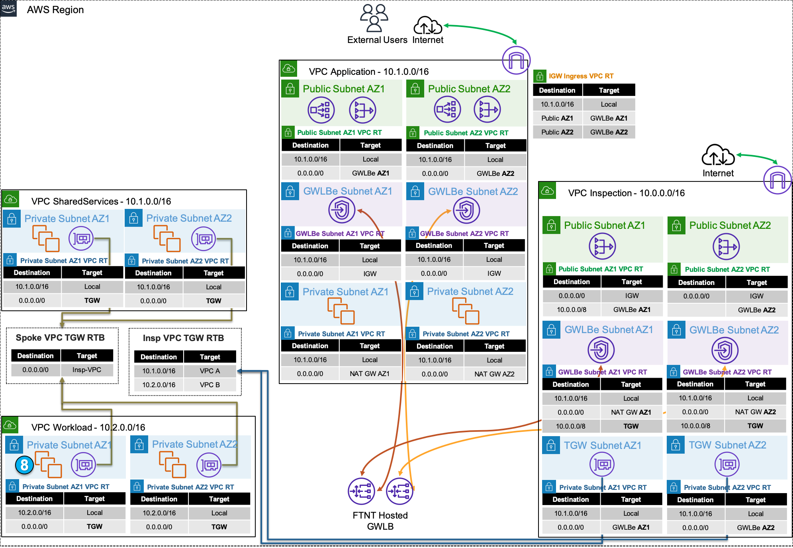

While there are many ways to organize your infrastructure there are two main ways to design your networking when using GWLB, centralized and distributed. From the perspective of networking, routing, and GWLBe endpoint placement

**Expand each section to see the details.**

{}

Decentralized designs do not require any routing between the protected VPC and another VPC through TGW. These designs allow simple service insertion with minimal routing changes to the VPC route tables. The yellow numbers show the initial packet flow for a session and how it is routed (using ingress and VPC routes) to the GWLBe endpoint which then sends traffic to the FortiGate CNF stack. The blue numbers show the returned traffic after inspection by the FortiGate CNF stack.

{}

{}

Centralized designs require the use of TGW to provide a simple hub and spoke architecture to inspect traffic. These can simplify east-west, egress, and ingress traffic inspection needs while removing the need for IGWs and NAT Gateways to be deployed in each protected VPC for egress inspection. You can still mix a decentralized architecture to inspect ingress and even egress traffic while leveraging the centralized design for all east-west inspection.

The yellow numbers show the initial packet flow for a session and how it is routed (using ingress, VPC routes, and TGW routes) to the GWLBe which then sends traffic to the FortiGate CNF stack. The blue numbers (east-west) and purple numbers (egress) show the returned traffic after inspection by the FortiGate CNF stack.

{}
{}

In a single region, you can have one deployment of FGTs & GWLB support both distributed and centralized designs.  This all comes down to implementing the appropriate routing at the VPC & TGW route tables and FortiGate routes.

{}