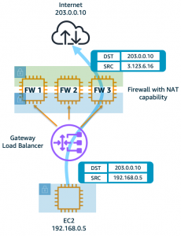

**Expand each section to see the details.**

{}

GWLB supports two different models of firewall deployments, one-arm and two-arm where a firewall appliance can also perform NAT.

In the one-arm model, the FortiGates will inspect traffic and forward this back to GWLB where internet bound traffic is has NAT applied by a NAT GW.  Typically, the NAT GW will be in a workload VPC in a distributed design.  Distributed designs have GWLBe endpoints in each workload VPC that requires to have an attached Internet Gateway (IGW) and public load balancer or NAT GW.


We can use static and policy routes like below to support this setup.  In a 2 AZ deployment there are two static routes using [**priority setting**](https://community.fortinet.com/t5/FortiGate/Technical-Note-Routing-behavior-depending-on-distance-and/ta-p/198221) to bypass the reverse path filtering check when receiving data plane traffic over the GENEVE tunnels.  The static routes are default routes to simplify the config, but you could also specify a route for each spoke VPC for each GENEVE tunnel.  Also, there are two policy routes to hairpin traffic received over each GENEVE tunnel, back to the same one.

```
config router static
edit 1
set distance 5
set priority 100
set device gwlb1-az1
next
edit 2
set distance 5
set priority 100
set device gwlb1-az2
next
end

config router policy
edit 1
set input-device gwlb1-az1
set output-device gwlb1-az1
next
edit 2
set input-device gwlb1-az2
set output-device gwlb1-az2
next
```

{}

{}

In the two-arm model, the FortiGates will inspect traffic and forward & SNAT traffic out port1 (public interface) to act as a NAT GW.  This removes the need for deploying NAT GWs in each AZ of each workload VPC.  This is a centralized design where the data plane traffic used TGW to reach the GWLBe endpoints in the inspection/security VPC and be inspected by the FortiGates.



We can use static and policy routes like below to support this setup.  In a 2 AZ deployment there are two static routes using [**priority setting**](https://community.fortinet.com/t5/FortiGate/Technical-Note-Routing-behavior-depending-on-distance-and/ta-p/198221) to bypass the reverse path filtering check when receiving data plane traffic over the GENEVE tunnels.  The static routes are default routes to simplify the config, but you could also specify a route for each spoke VPC for each GENEVE tunnel.  Also, there are two policy routes to hairpin traffic received over each GENEVE tunnel, back to the same one.  These policy routes will only hairpin traffic destined RFC1918 addresses and will route internet bound traffic out port1.

```
config router static
edit 1
set distance 5
set priority 100
set device gwlb1-az1
next
edit 2
set distance 5
set priority 100
set device gwlb1-az2
next
end

config router policy
edit 1
set input-device gwlb1-az1
set dst "10.0.0.0/255.0.0.0" "172.16.0.0/255.240.0.0" "192.168.0.0/255.255.0.0"
set output-device gwlb1-az1
next
edit 2
set input-device gwlb1-az2
set dst "10.0.0.0/255.0.0.0" "172.16.0.0/255.240.0.0" "192.168.0.0/255.255.0.0"
set output-device gwlb1-az2
next
```

{}
{}

In a single region, you can have one deployment of FGTs & GWLB support both distributed and centralized designs.  This all comes down to implementing the appropriate routing at the VPC & TGW route tables and FortiGate routes.  For examples on the VPC & TGW routes for different designs, reference [**common architecture patterns**](71_usecase1.html).

Here is an example of the static & policy routes to support a distributed spoke1 VPC (CIDR 10.1.0.0/16) and centralized spoke2 VPC.  

```
config router static
edit 1
set distance 5
set priority 100
set device gwlb1-az1
next
edit 2
set distance 5
set priority 100
set device gwlb1-az2
next
end

config router policy
edit 1
set input-device gwlb1-az1
set src "10.1.0.0/16"
set output-device gwlb1-az1
next
edit 2
set input-device gwlb1-az2
set src "10.1.0.0/16"
set output-device gwlb1-az2
next
edit 3
set input-device gwlb1-az1
set dst "10.0.0.0/255.0.0.0" "172.16.0.0/255.240.0.0" "192.168.0.0/255.255.0.0"
set output-device gwlb1-az1
next
edit 4
set input-device gwlb1-az2
set dst "10.0.0.0/255.0.0.0" "172.16.0.0/255.240.0.0" "192.168.0.0/255.255.0.0"
set output-device gwlb1-az2
next
```

{}