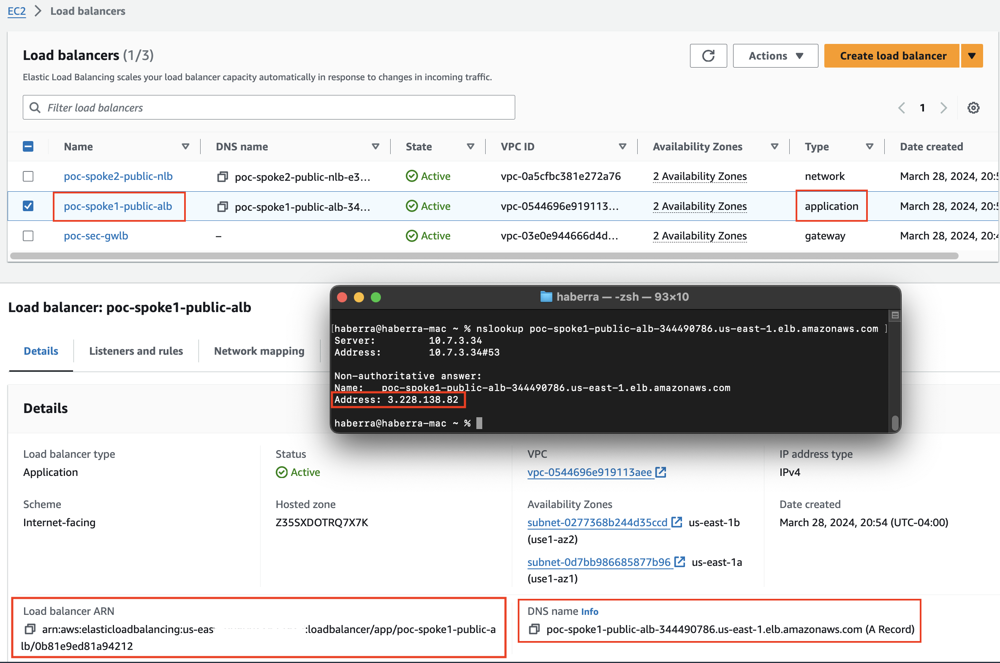
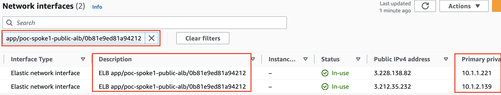
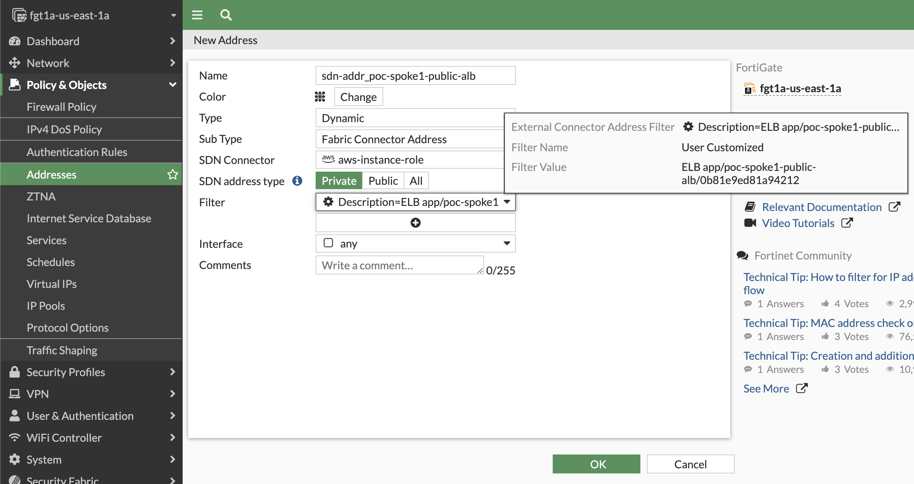
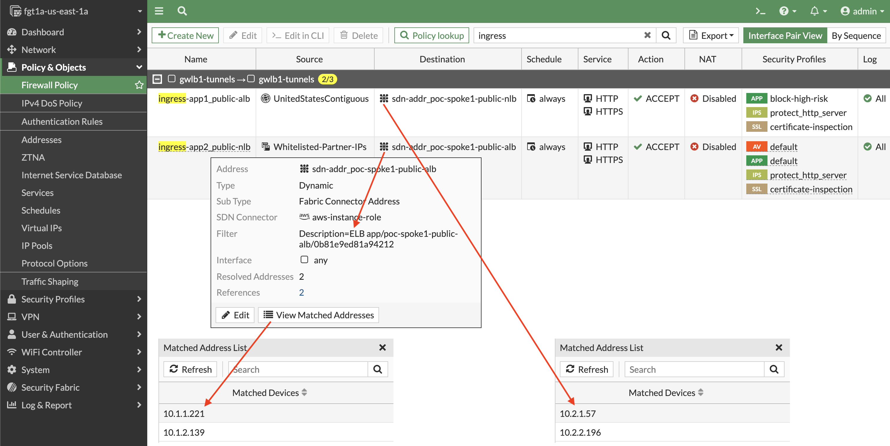

When inspecting ingress traffic, it is common to need to control traffic for specific public resources such as Public ALBs & NLBs. While you can create a broad firewall policy that controls traffic destined to the protected public subnets, giving every public resource the same level of control, more granularity is needed.

While we can use the load balancer DNS A record to resolve the public IPs, this does not give us the private IPs.  When inspecting ingress traffic with GWLB, we need to match NGFW policy based on the private IPs.



To accomplish this, we can use the [**SDN connector in advanced mode**](https://docs.fortinet.com/document/fortigate-public-cloud/7.4.0/aws-administration-guide/307739) to allow us to search for resources based on attributes such as owner ID, resource descriptions, and tags.  For ALBs/NLBs we can use the description of the network interfaces to dynamically find the public or private IPs.

Here is an example of searching for the network interfaces of the load balancer by description.  We are searching using the tail end of the load balancer ARN shown in the picture above, in the bottom left of the load balancer details pane.



You can enable this advanced or alternate resource mode for an SDN connector with the command **set alt-resource-ip enable**. Here is an example SDN config:
```
config system sdn-connector
edit aws-instance-role
set status enable
set type aws
set use-metadata-iam enable
set alt-resource-ip enable
next
end
```

Once enabled, you create a dynamic address object using the description of the load balancers.  This will be polled and resolve to the current private IPs of any matching network interfaces.  Now we can easily create per application NGFW policies and control traffic to the dynamic IPs of the load balancers.



